# Post-Processing Pipeline - UNBIASED

This pipeline is designed to process the concatenated `HybriDetector` output `*.unified_length_all_types_unique_high_confidence.tsv` files from various experiments (Manakov et al., 2022; Hejret et al., 2023; Klimentova et al., 2022) to produce structured datasets suitable for supervised machine learning methods. Importantly, it is intended to mitigate the identified *miRNA frequency class bias*, and therefore produce datasets that are free from this bias.  

Processing includes:

- `0_post_process`: filtering for miRNAs and deduplicating miRNA--target pairs in the datasets;
- `1_post_process`: creating a completely unseen test set, with miRNAs from miRNA families unique to this set; 
- `2_post_process`: generating negative examples while mitigating the identified miRNA frequency class bias; 
- `3_post_process`: train-test splitting; and 
- `4_post_process`: removing redundant columns.

There are two main bash scripts:  
1. `RUNME_0.sh`: Downloads and standardises (miRBench format) the necessary files into the `data/` directory.  
2. `RUNME_1.sh`: Runs the processing pipeline outlined above using these datasets. 

## Dependencies

- `wget`
- `gunzip`
- Python (version 3.8.20)
   - `pandas` (version 1.2.5)
- R (version 4.3.1)
  - `Biostrings` (version 2.70.3)
  - `DECIPHER` (version 2.30.0)

## Overview

The `RUNME_1.sh` script runs as follows:

```mermaid
graph LR
  %% Define files
  M[Manakov_positives.tsv]
  H[Hejret_positives.tsv]
  K[Klimentova_positives.tsv]
  
  %% Process 0: Filter & Deduplicate
  pp0[Filter & Deduplicate]
  Mfilt[Manakov.filt_and_dedup.tsv]
  Hfilt[Hejret.filt_and_dedup.tsv]
  Kfilt[Klimentova.filt_and_dedup.tsv]

  %% Process 1: Exclude MiRNA Families
  pp1[Exclude miRNA Families]
  Mexcl[Manakov.excluded.tsv]
  Mrem[Manakov.remaining.tsv]

  %% Process 2: Make Negatives
  pp2[Make Negatives]
  Mexclneg[Manakov.excluded.negatives.tsv]
  Mremneg[Manakov.remaining.negatives.tsv]
  Hneg[Hejret.filt_and_dedup.negatives.tsv]
  Kneg[Klimentova.filt_and_dedup.negatives.tsv]

  %% Process 3: Train/Test Split
  pp3[Train/Test Split]
  Mtrain[Manakov.remaining.negatives.train.tsv]
  Mtest[Manakov.remaining.negatives.test.tsv]
  Htrain[Hejret.filt_and_dedup.negatives.train.tsv]
  Htest[Hejret.filt_and_dedup.negatives.test.tsv]

  %% Process 4: Drop Test Column
  pp4[Drop Test Col]
  MleftoutFinal[Manakov_leftout.tsv]
  MtrainFinal[Manakov_train.tsv]
  MtestFinal[Manakov_test.tsv]
  HtrainFinal[Hejret_train.tsv]
  HtestFinal[Hejret_test.tsv]
  KtestFinal[Klimentova_test.tsv]

  %% Connections
  M --> pp0
  H --> pp0
  K --> pp0
  pp0 --> Mfilt
  pp0 --> Hfilt
  pp0 --> Kfilt

  Mfilt --> pp1
  Hfilt --> pp1
  Kfilt --> pp1
  pp1 --> Mexcl
  pp1 --> Mrem

  Mrem --> pp2
  Mexcl --> pp2
  Hfilt --> pp2
  Kfilt --> pp2

  pp2 --> Mexclneg
  pp2 --> Mremneg
  pp2 --> Hneg
  pp2 --> Kneg

  Mremneg --> pp3
  Hneg --> pp3
  pp3 --> Mtrain
  pp3 --> Mtest
  pp3 --> Htrain
  pp3 --> Htest

  Mexclneg --> pp4
  Mtrain --> pp4
  Mtest --> pp4
  Htrain --> pp4
  Htest --> pp4
  Kneg --> pp4

  pp4 --> MleftoutFinal
  pp4 --> MtrainFinal
  pp4 --> MtestFinal
  pp4 --> HtrainFinal
  pp4 --> HtestFinal
  pp4 --> KtestFinal

  %% Styles
  classDef file fill:#E0F7FA,stroke:#00796B,stroke-width:2px,color:black;
  classDef process fill:#FFE0B2,stroke:#E65100,stroke-width:2px,color:black;

  class M,H,K,Mfilt,Hfilt,Kfilt,Mexcl,Mrem,Mexclneg,Mremneg,Hneg,Kneg,Mtrain,Mtest,Htrain,Htest,MtrainFinal,MtestFinal,MleftoutFinal,HtrainFinal,HtestFinal,KtestFinal file;
  class pp0,pp1,pp2,pp3,pp4 process;
```



Refer to the relevant scripts for documentation on running each step in the post-processing pipeline.  

## Folder Structure

After running `RUNME_0.sh` and `RUNME_1.sh`, the `06_post_process_unbiased` directory will have the following structure:
```
data/
├── AGO2_eCLIP_Manakov2022_positives.tsv
├── AGO2_CLASH_Hejret2023_positives.tsv
└── AGO2_eCLIP_Klimentova2022_positives.tsv

results/
├── 0_post_process/
│   ├── AGO2_eCLIP_Manakov2022.filt_and_dedup.tsv
│   ├── AGO2_CLASH_Hejret2023.filt_and_dedup.tsv
│   ├── AGO2_eCLIP_Klimentova2022.filt_and_dedup.tsv
│   └── intermediate/
├── 1_post_process/
│   ├── AGO2_eCLIP_Manakov2022.excluded.tsv
│   ├── AGO2_eCLIP_Manakov2022.remaining.tsv
│   └── intermediate/
├── 2_post_process/
│   ├── AGO2_eCLIP_Manakov2022.excluded.negatives.tsv
│   ├── AGO2_eCLIP_Manakov2022.remaining.negatives.tsv
│   ├── AGO2_CLASH_Hejret2023.filt_and_dedup.negatives.tsv
│   ├── AGO2_eCLIP_Klimentova2022.filt_and_dedup.negatives.tsv
│   └── intermediate/
├── 3_post_process/
│   ├── AGO2_eCLIP_Manakov2022.remaining.negatives.train.tsv
│   ├── AGO2_eCLIP_Manakov2022.remaining.negatives.test.tsv
│   ├── AGO2_CLASH_Hejret2023.filt_and_dedup.negatives.train.tsv
│   └── AGO2_CLASH_Hejret2023.filt_and_dedup.negatives.test.tsv
├── 4_post_process/                            # The contents of this directory are moved to results/ and renamed to the final dataset files
│   ├── AGO2_eCLIP_Manakov2022.excluded.negatives.dropped_test_col.tsv
│   ├── AGO2_eCLIP_Manakov2022.remaining.negatives.train.dropped_test_col.tsv
│   ├── AGO2_eCLIP_Manakov2022.remaining.negatives.test.dropped_test_col.tsv
│   ├── AGO2_CLASH_Hejret2023.filt_and_dedup.negatives.train.dropped_test_col.tsv
│   ├── AGO2_CLASH_Hejret2023.filt_and_dedup.negatives.test.dropped_test_col.tsv
│   └── AGO2_eCLIP_Klimentova2022.filt_and_dedup.negatives.dropped_test_col.tsv
├── AGO2_eCLIP_Manakov2022_leftout.tsv         # Final leftout set for Manakov
├── AGO2_eCLIP_Manakov2022_train.tsv           # Final train set for Manakov
├── AGO2_eCLIP_Manakov2022_test.tsv            # Final test set for Manakov
├── AGO2_CLASH_Hejret2023_train.tsv            # Final train set for Hejret
├── AGO2_CLASH_Hejret2023_test.tsv             # Final test set for Hejret
├── AGO2_eCLIP_Klimentova2022_test.tsv         # Final test set for Klimentova
├── RUNME_0.log
└── RUNME_1.log
```

The final datasets have been uploaded to https://zenodo.org/records/14501607, including detailed metadata. 